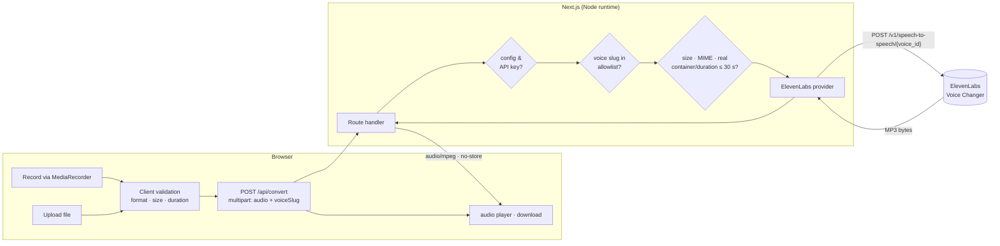

# Architecture

This document explains how the MVP is built and, more importantly, why. It is the reference for anyone extending the prototype toward a product.

## 1. Overview

A single Next.js application (App Router, TypeScript, Tailwind) serves both the one-page UI and the only backend endpoint, `POST /api/convert`. There is no database, no object storage, no queue, no auth and no separate backend service.



## 2. Why speech-to-speech, not STT → TTS

The product value is **performance preservation**: the same words *and* the same timing, rhythm, pauses, emphasis, emotion, laughter and accent, rendered in a different voice. A speech-to-text → text-to-speech pipeline discards everything except the words and then re-performs them; that is a different product (narration) and it destroys exactly what we are selling. ElevenLabs Speech-to-Speech / Voice Changer operates on audio directly, so nothing is transcribed, rewritten, translated or generated by an LLM.

The multilingual model (`eleven_multilingual_sts_v2`) is used so English, Hindi and Hinglish speech work without configuration.

## 3. Request lifecycle

1. **Source capture.** Recording uses `MediaRecorder` with the first supported container from `audio/webm;codecs=opus`, `audio/ogg;codecs=opus`, `audio/webm`, `audio/mp4`, `audio/ogg`. No client-side transcoding — ElevenLabs accepts these directly. Uploads are validated by extension/MIME and their duration read through an `<audio>` element (with the `Infinity`-duration workaround for header-less WebM).
2. **Client validation** (`lib/audio/validation.ts`, shared with the server) gives immediate feedback and prevents pointless uploads. It is a convenience, not a security boundary.
3. **Route handler** (`lib/api/convert.ts`) runs the authoritative checks strictly in this order, and only contacts the provider after all pass:
   1. server configuration present (`ELEVENLABS_API_KEY`)
   2. declared `Content-Length` under the cap (rejects oversized bodies before reading them)
   3. multipart shape, audio part present
   4. `voiceSlug` in the server allowlist and resolvable to a configured voice ID
   5. byte size under `MAX_AUDIO_SIZE_MB`
   6. declared MIME/extension in the supported set
   7. **real container and duration** from the bytes (`lib/audio/server-metadata.ts`) — `music-metadata` for MP3/WAV/FLAC/OGG/M4A/WebM, plus a purpose-built EBML block scanner (`lib/audio/webm-duration.ts`) because Chrome's MediaRecorder writes WebM without an `Info.Duration` element, which general parsers report as "unknown"
   8. duration ≤ limit (+0.5 s tolerance for encoder padding)
4. **Provider call** (`lib/elevenlabs/`) builds the documented multipart request (`audio`, `model_id`, optional `remove_background_noise`) with `output_format=mp3_44100_128`, a timeout, and the request's abort signal so a cancelled browser request also cancels the upstream one.
5. **Response.** MP3 bytes with `Content-Type: audio/mpeg`, `Cache-Control: no-store`, and safe timing headers (`X-Processing-Ms`, `X-Provider-Ms`, `X-Source-Duration-Seconds`). Errors are a consistent `{ error: { code, message } }` JSON body whose message is written for end users and never contains provider payloads or secrets.
6. **Playback.** The browser holds the result as a Blob/Object URL, attempts autoplay, always shows native controls, and offers a download named `voice-conversion-YYYY-MM-DD-HHMM.mp3`. Object URLs are revoked when replaced, discarded or on unmount.

## 4. Why there is no database

Nothing in the MVP needs to outlive a request. Storing recordings would add cost, a privacy liability and a whole compliance surface for zero product value at this stage. Accounts, history and saved voices are roadmap items (Phase 3) that will justify a datastore *when they exist*. Until then, source audio is a `Uint8Array` in the handler's scope and generated audio is streamed back immediately.

This also keeps the app trivially deployable: any Node host that can run `next start`, with environment variables as the only configuration.

## 5. Why target voice IDs are server-controlled

The browser never sends an ElevenLabs voice ID. It sends one of three internal slugs; `lib/voices/config.ts` maps a slug to an environment variable holding the trusted ID and validates the ID's shape. Reasons:

- **Key misuse.** If clients could pick arbitrary voice IDs, our API key would become an open proxy to any voice in the user's reach, including cloned or restricted ones.
- **Abuse control.** The only voices reachable through this app are synthetic, developer-designed ones — no celebrities, no real people.
- **Configuration errors fail safely.** A slug with no configured ID is rejected with a clear message; the page shows a setup checklist when nothing is configured.
- **Evolution.** When user-owned custom voices arrive, the same resolver can consult a per-user voice store instead of `process.env` without changing the UI contract.

## 6. Provider boundary

`lib/elevenlabs/types.ts` defines a deliberately small interface:

```ts
interface VoiceConversionProvider {
  readonly name: string;
  convert(input: { audio; mimeType; fileName; voiceId; signal? }): Promise<{ audio; mimeType; providerLatencyMs }>;
}
```

`ElevenLabsVoiceConversionProvider` is the only implementation. Provider failures are normalised into `ProviderError` with a small set of codes (`auth`, `permission`, `plan-required`, `quota`, `rate-limit`, `voice-not-found`, `invalid-audio`, `invalid-request`, `timeout`, `network`, `upstream`), mapped from ElevenLabs' `detail.status` (legacy) and `detail.code` (current) identifiers. The API layer then decides HTTP status and user wording. The route handler, tests and UI depend only on the interface and the error codes, so a second provider, a self-hosted model or a realtime backend can be introduced without touching the UI.

A `VoiceCloningProvider` type is declared next to it as documentation of the intended future shape (Phase 2). Nothing implements or exposes it.

## 7. Privacy model

- **Our application:** no persistence. No recordings, generated audio, filenames, transcripts, IPs tied to audio, or histories are written anywhere. Logs carry durations, sizes, status codes, internal slugs and, on provider failures, the provider's short error explanation — never audio or credentials.
- **ElevenLabs:** an external processor. Source audio is sent to it and the output comes from it; retention, history and training policies are governed by the user's ElevenLabs plan and ElevenLabs' terms. Zero-retention mode (`enable_logging=false`) is not assumed to be available on the free plan and is not requested.
- **UI wording** reflects exactly this: "We don't save recordings in this application. Audio is sent to ElevenLabs for voice processing and is subject to their processing policies." No stronger claim is made anywhere.
- **Consent:** uploads require ticking "I confirm I have permission to use this recording." Recordings are the user's own voice by construction.

## 8. Free-tier constraints and credit protection

The free plan gives roughly 10 000 credits/month; Voice Changer costs roughly 1 000 credits per minute, so the whole monthly budget is about 10 minutes of source audio. Consequently:

- 30-second hard cap, enforced by the recorder (auto-stop), by client validation and, authoritatively, by the server's byte-level probe.
- 15 MB default size cap (4 MB recommended on Vercel), enforced before the body is read where possible.
- No provider call until every check passes; unparseable or duration-less files are rejected rather than forwarded.
- Quota exhaustion (`quota_exceeded` / `insufficient_credits`) is mapped to HTTP 429 with the message "Demo usage limit reached…", and rate limits to a "try again shortly" message.
- The recommended API-key setup is a dedicated key with restricted permissions and a credit cap, so even a leaked key cannot overspend.
- Instant/Professional Voice Cloning and Voice Library access are not used because they are unavailable or restricted on the free plan. Empirically (September 2026), the free plan's speech-to-speech API accepts voices the account generated with Voice Design and ElevenLabs' current built-in default voices, and rejects any Voice Library voice with `402 paid_plan_required`; this is mapped to a distinct `provider-plan-required` error rather than "quota exhausted", and `scripts/check-elevenlabs.mjs` can probe each configured voice.

## 9. Client state model

`components/voice-transformer/voice-transformer.tsx` holds a reducer over a discriminated union:

```
idle ─▶ recording ─▶ source-ready ─▶ processing ─▶ result-ready
  ▲                       ▲              │              │
  └── discard / reset ────┴── retry ◀── error ◀─────────┘
```

Uploads land directly in `source-ready` (`source.origin` distinguishes them). Errors keep the source when one exists so "Try again" re-submits without re-recording; input errors (denied microphone, bad file) keep the input controls mounted so the user can immediately retry. Everything is local React state — no global store.

Microphone ownership lives in `hooks/use-recorder.ts`: permission is requested only from a click, the timer auto-stops at the limit, and every track, `AudioContext` and interval is released on stop, cancel and unmount.

## 10. Security summary

- API key only in `ELEVENLABS_API_KEY`, read in `lib/server/config.ts` (guarded by `server-only`), never logged, never serialised, never in client chunks (verified by grepping the production build).
- `.env*` git-ignored (except `.env.example`).
- Strict voice-slug allowlist; no client-supplied voice IDs or provider URLs.
- Size limits enforced before reading bodies; formats and durations verified from bytes.
- Provider responses are never forwarded verbatim; all errors are rewritten to a fixed, user-safe vocabulary.
- No user-controlled HTML is rendered; filenames are rendered as text.
- Request abort propagates upstream, so closing the tab does not leave a provider request running longer than necessary.

## 11. Testing strategy

- **Pure modules** (validation, formatting, voice registry, error mapping) — unit tests.
- **Server metadata** — tested against real container fixtures generated with ffmpeg, including "live" WebM without a duration header and a 31-second file that must be rejected.
- **Provider** — tested with an injected `fetch`, asserting the exact URL, header, and multipart fields.
- **Route handler** — tested as a function of `Request` with injected env/provider/probe/logger; covers every rejection path, provider error mapping, and that the API key never appears in any response.
- **UI** — React Testing Library with mocked `MediaRecorder`, `getUserMedia`, `fetch` and Object URLs, walking idle → recording → source-ready → processing → result, error → retry, upload consent, and validation errors.

No test uses network access or ElevenLabs credits.
